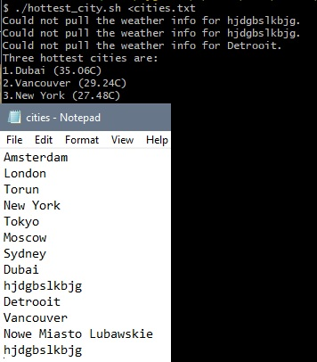

# HottestCities

Used Visual Studion 2022, 6.0 NET to create this app. Includes solution , classes and bin.  

## C# Application
GetCurrentWeather C# console application for getting current weather
The program pulls the weather information for a single given city from OpenWeather API (https://openweathermap.org/current).
•	the program reads OpenWeather API key from environment variable OPENWEATHER_API_KEY  
(You can sign up and acquire an API key on the openweathermap to call current weather information endpoints)  
•	the program accepts the following command line options:  
 &nbsp;&nbsp;I.--city or -c with a city argument after that e.g. --city Torun (the application exits with a non-zero exit code if no city was passed.)  
 &nbsp;&nbsp;II.	--units or -u with a units type argument (can be imperial or metric, default is metric. For unknown values the application exits with a non-zero exit code.)  
•	if a city cannot be found the application exits with a non-zero exit code  
•	the program outputs following format:  
$ ./GetCurrentWeather --city London --units metric  
London|14.29|2.57|87|1025  
city|temp|wind_speed|humidity|pressure  

## Bash script
hottest_city.sh script uses GetCurrentWeather C# application to get the current weather information for given list of cities and output 3 hottest city names and their temperature right now.  
•	calls to GetCurrentWeather C# app are made in parallel  
•	for the cities for which C# application returned with non-zero exit status code an error line is printed 
•	a path to GetCurrentWeather C# application binary is passed via environment variable GET_CURRENT_WEATHER_BIN  
•	script accept a list of city names on standard input   
•	the output format:  

